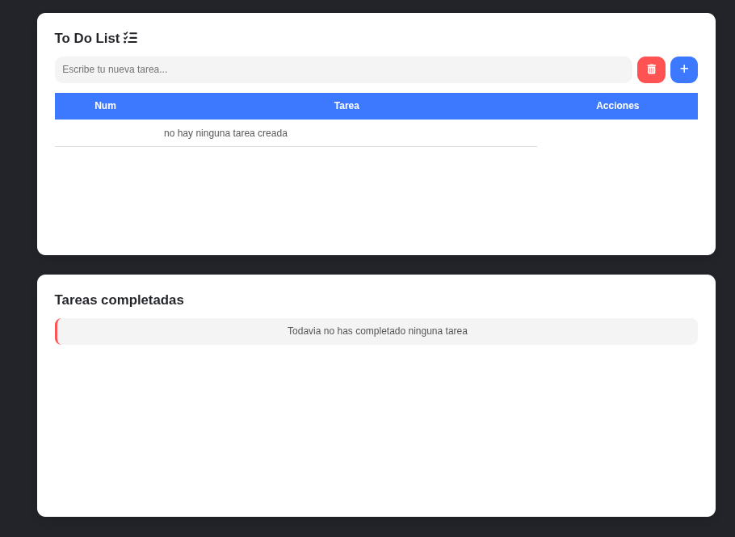
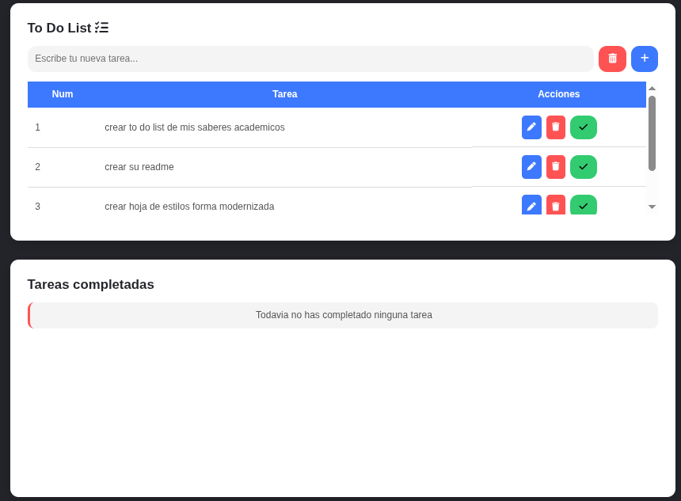
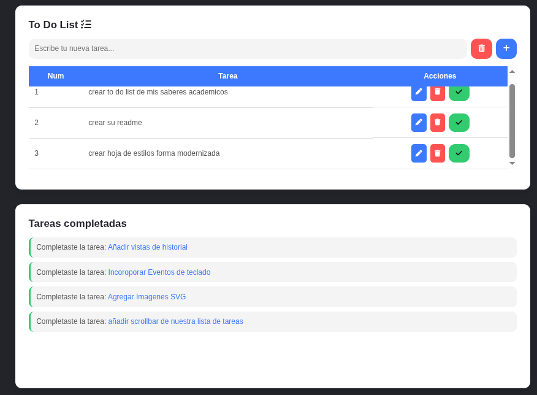
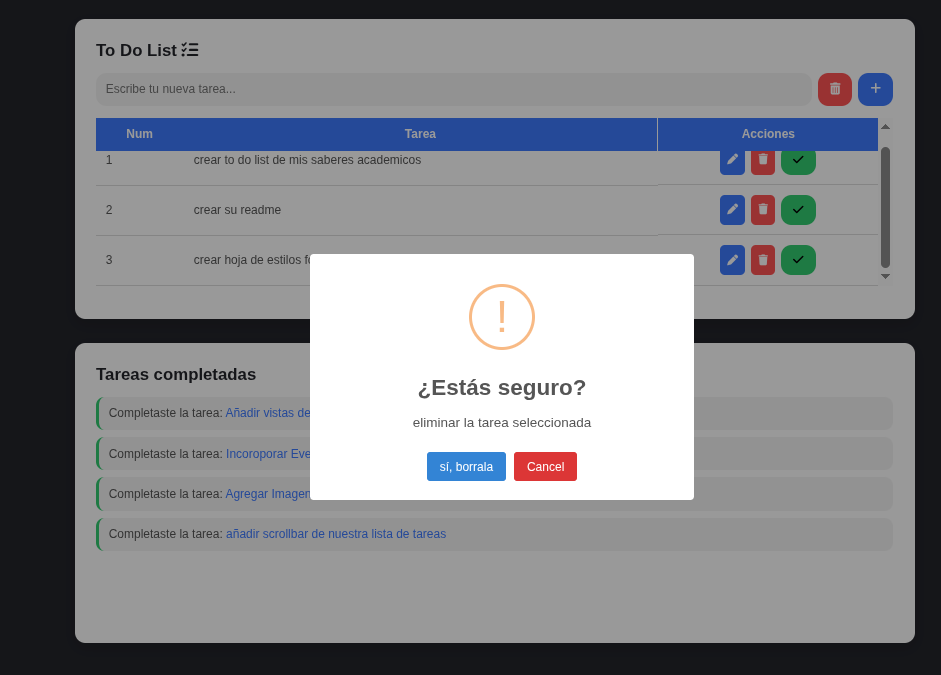
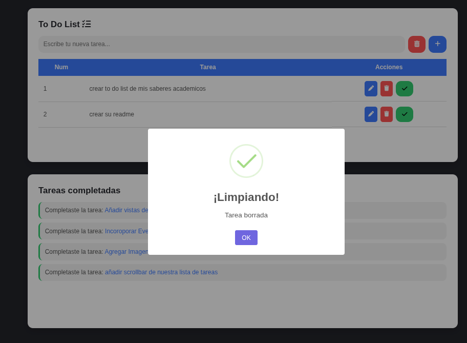
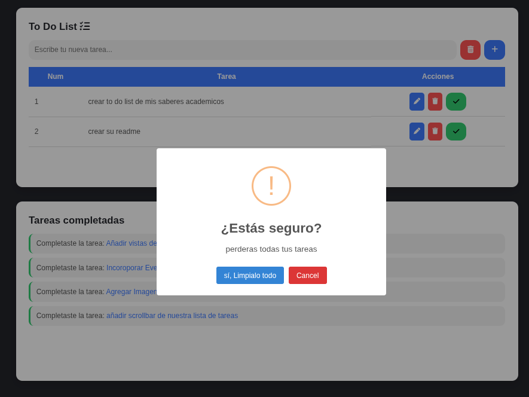
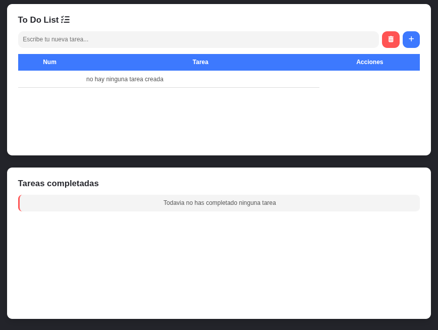

# To Do List con javascript

creacion de un to do list con javascript utilizando localstorage, array methods e incorporando la libreria swaljs para modals dentro del sistema.

## Tecnologias usadas.
- html5
- CSS3 
- JavaScript Vanilla ES5

## Funciones.
- agregar tarea.
    - maneja validacion cuando no se agrega nada escrito, no agrega ninguna tarea y manda un aviso de alerta.
- borrar tarea.
    - maneja aviso de confirmacion.
- editar tarea.
    - maneja input value y un nuevo arreglo de almacen, ademas de poder manejar las ID's de nuestro arreglo.
- borrar todas las tareas.
    - maneja validacion, es decir si no hay ninguna tarea agregada no entrara la funcion de eliminar todas las tareas.
- mostrar historial.
    - maneja validacion de mostrar un aviso cuando no hay ninguna tarea completada.
- guardar historial.

## Vistas previas.

### vista principal de to do list.

### vista tareas ya incorporadas.

### vista acompletando las tareas pasadas a historial.

### vista implementando swal eliminar una tarea.

### vista implementando swal para aviso de confimacion de eliminacion.

### vista implementando swal eliminando todo.

### vista implementado swal nex, todas las tareas eliminadas.

## Uso
1. Descarga este repositorio con git clone.
2. Abre en tu IDE favorito.
3. puedes implementar liveServer para poder abrir el archivo index.
4. Abre en el puerto 5500 que te da el liveServer.

## Licencia
Este miniproyecto es de uso libre.