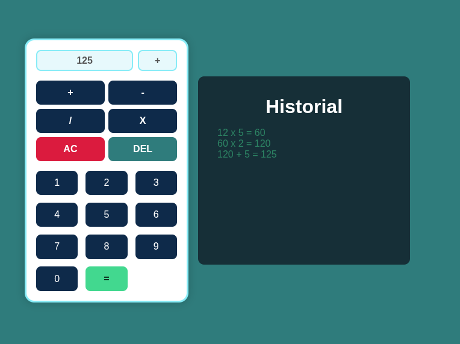

#Calculadora con javascript

Este mini proyecto es una calculadora basica hecha con javascript, html, y hoja de estilos css. incluye funciones como sumar, restar, multiplicar y dividir. se manejo lo que son los eventos de botones así como su value y la implementacion de appendchild.

##Tecnologias usadas
-HTML5
-CSS3
-JavaScript Vanilla

##Funciones
-resetear los datos de la calculadora.
-resultado de la calculadora.
-leer valores de los botones.
-borrar un string dentro del input.
-recabar historial de multiplicaciones.

##vista previa

##como usar
1.- puedes utilizar open live server, el cual desde tu index.html ejecuta una instancia de servidor web con el puerto 5500
2.- dirigite a la url local de tu equipo bajo el puerto 5500.
3.- listo, puedes usar la calculadora.

##licencia
Este miniproyecto es de uso libre.

