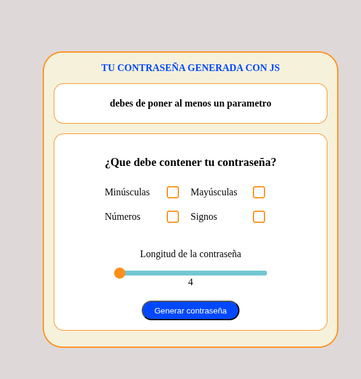
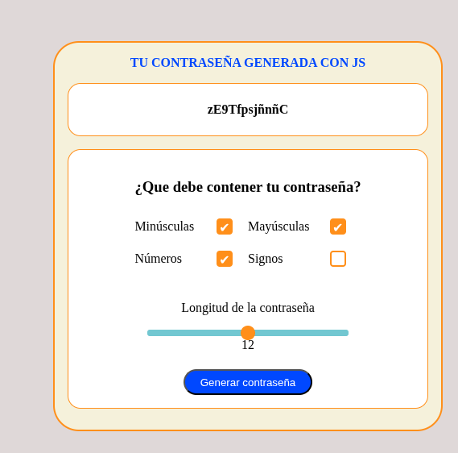

# Generador de contraseña con JS, html y css

Este es un mini-proyecto, para poder practicar el uso de getRandomValue, así como la implementacion de un scrollbar e inputs tipo checkboxes.

## Tecnologías usadas.

- html5.
- CSS3.
- javaScriptVanilla.

## Funciones.

Se manejo una funcion callback dentro del evento del boton de generar contraseña. ahí se condiciono las situaciones de cada checkbox y se utilizó el metodo getRandomValues para poder generar la contraseña.

## Vista Previa.

- se manejo el caso de que no se haya almacenado ningun checkbox para crear la contraseña

- y ya una vez seleccionado ir generando contraseña por contraseña, al igual que una longitud de contraseña

## Como usar.

1. abre el mini proyecto live server.
2. selecciona los campos.
3. genera tu contraseña.

## Licencia.

- Este proyecto es de uso libre